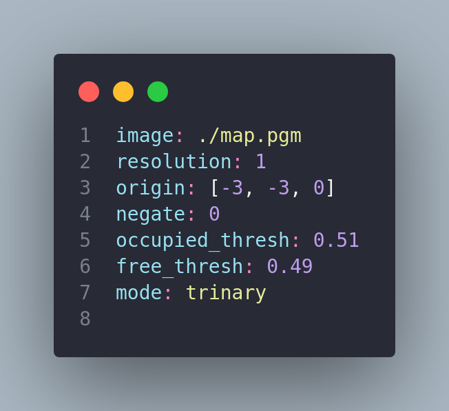
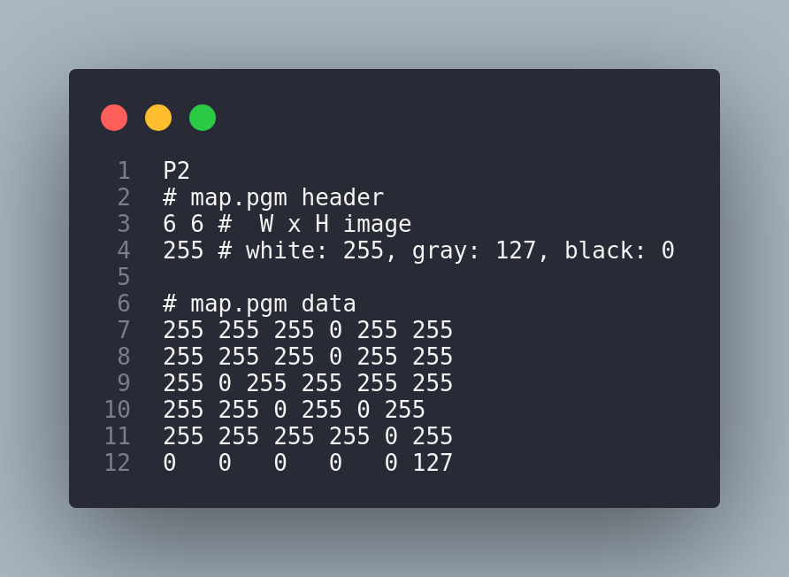

# Introduction

This is a ros package that given a pgm image, representing a map, let's you choose the initial robot position through rviz initial_pose and finds a path to the goal using BFS.


## Setup

Assuming you are using `ros-noetic` and using the [lattinone virtual machine](https://sites.google.com/diag.uniroma1.it/robot-programming-2023-24/teaching-material?authuser=0#:~:text=Virtual%20Machine%20Image) the only missing package is map_server.

```bash
sudo apt-get install ros-noetic-map-server
```

## How to run

A simple bash script is provided, launching is just a matter of calling it.

```bash
git clone https://github.com/Haislich/simple_planner.git
cd simple_planner
bash run.sh
```

At it's core the `run.sh` file uses roslaunch, and in particulare calls `./src/simple_planner/launch/simple_planner.launch`.
This files first calls rosocre, and then sequentiually starts `map_server` with the map saved in `./maps/map.yaml`, `rviz` with the configuration file saved in `./maps/map.rviz` and last call the `main_node` of the simple planner.

## How does it work

The map is defined through a plain PGM file. The decision to use a plain PGM format stems from its simplicity—it uses ASCII decimal numbers, allowing for easy editing on the fly through any text editor.

n the PGM file, each pixel (cell) can assume three values: $255$, $127$, or $0$, corresponding respectively to Road, Goal, and Obstacle.

To use this map effectively, we need to employ a map server. The map server reads a configuration file in YAML format. Let's consider an example:

| Yaml configuration file   |  Raw image  | Actual image  |
| -------- | ------- | ------- |
|  |      |   |

An important part is the origin section but will be discussed later. For now, it is important to note that when using trinary mode, the values read from the map topic published by the map server do not match the actual values found in the raw image. Instead, the following mapping applies:

- **Obstacle** is mapped to $100$
- **Goal** is mapped to $-1$
- **Road** is mapped to $0$

More information about this mapping can be found [here](http://wiki.ros.org/map_server#:~:text=Nomenclature%20is%20hard.-,Trinary,-The%20standard%20interpretation).

Now that we have uploaded the map into the map server, which publishes a topic represented with a vector, the unusual aspect is how this vector maps onto the original image. This mapping uses an inverted row-major configuration. Let's clarify what I mean with a visual example:

| 1 | 2 |3|
|-| - | -|
| **4** | **5** |**6** |
| **7** | **8** |**9** |

This matrix would be mapped to:

| 7 | 8 | 9 | 4 | 5 | 6 | 1 | 2 | 3 |
|-  | - | - |-  | - | - |-  | - | - |

which is quite an odd mapping, but we have to work with it.
For the time being however let's keep it aside as it will be important later.

This mapping may seem unusual, but it's the way we have to work with the data. Let's set this aside for now, as it will be important later.

The map needs to be used by RViz for visualization purposes. However, we must proceed with caution, as RViz works with a continuos plane centered at $(0,0)$. Let’s look at how changing the origin in the YAML file from $(0,0)$ to $(-3,-3)$ affects the visualization:

|Example of visualization with origin $(-3,-3)$|Example of visualization with origin $(0,0)$|
|-|-|
|||

Changing the origin adds an offset to compensate for RViz's behavior. Once we're in RViz, we need to pay attention to something else: RViz views the map as continuous space, so we need to convert it to discrete space.

To maintain a consistent representation of the map, I assumed that in the original matrix space, the matrix starts at the upper left corner at $(0,0)$. To maintain this consistency, I created two classes that map coordinates from RViz/map server into the original matrix space: `server_map_handler.cpp/MapCoord` and `rviz_handler.cpp/RvizCoord`.

Both classes require a mathematical formula that I needed to find. However, due to the complex structure of `RvizCoord`, I couldn't find a suitable function mapping from discrete coordinates to `RvizCoord` when there were odd values of rows or columns (I can delve deeper into this with the TA, but I feel a written explanation would be too cumbersome here).

Now that we have established the foundation, the workflow is straightforward. We start by creating three nodes: `main_node` listens to the `map` topic published by `map_server` and then begins publishing topics to `RViz` for visualization. Once everything is connected, BFS starts and waits for user input (a key press on Enter) to initiate the visualization, which will stop and kill all the nodes on user input (another key press on Enter).

## Additional Resources

- [PGM format](https://netpbm.sourceforge.net/doc/pgm.html)
- [Plain PGM](https://netpbm.sourceforge.net/doc/pgm.html#:~:text=There%20is%20actually%20another%20version%20of%20the%20PGM%20format%20that%20is%20fairly%20rare%3A%20%22plain%22%20PGM%20format)
- [MAP server](https://wiki.ros.org/map_server)
- [Marker Example for rviz](http://wiki.ros.org/rviz/Tutorials/Markers%3A%20Basic%20Shapes)
- [How to document](https://softwareengineering.stackexchange.com/questions/84071/is-it-better-to-document-functions-in-the-header-file-or-the-source-file)
- [Log on screen when roslaunching](https://answers.ros.org/question/258512/enable-roslaunch-to-log/)
- [Map Server](http://wiki.ros.org/map_server)
